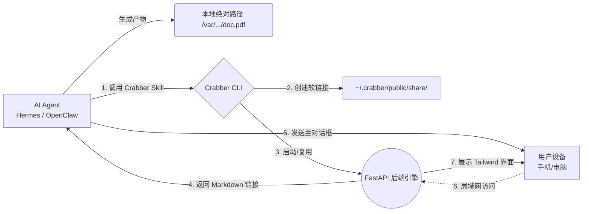

<div align="center">
  
  <h1>Crabber Skill</h1>
  <p><b>为 AI Agent 打造的局域网「最后一米」无感文件投递方案</b></p>
  
  <p>
    <a href="https://python.org"></a>
    <a href="https://fastapi.tiangolo.com/"></a>
    <a href="https://tailwindcss.com/"></a>
    
  </p>
</div>

<hr>

## 📖 简介 (Introduction)

**Crabber Skill** 是一个专为运行在无头服务器（如 Mac mini）上的 AI Agent（如 Hermes、OpenClaw 等）设计的轻量级插件服务。

当您的 Agent 帮您生成了 PPT、PDF、图表或代码包时，如何优雅地将这些文件提取到您的手机或当前工作电脑上？
以往的做法可能需要 SSH 登录、使用 SCP 下载或配置文件共享。而现在，**Crabber** 只需要一行指令，就能为您自动生成一个绝美的局域网下载页面，并以 Markdown 链接的形式发回给您。**点击即下载，阅后即焚。**

## ✨ 核心特性 (Features)

- ⚡️ **极速无感投递**: Agent 端一键调用，无需复杂的配置与传输等待。
- 🎨 **Apple 级美学体验**: 内置基于 Tailwind CSS 构建的深色模式 UI，自动匹配文件拓展名图标，响应式适配移动端。
- 🔗 **零拷贝与空间隔离**: 采用软链接 (Symbolic Link) 映射文件，拒绝占用额外存储空间，严格防止非授权目录暴露。
- 🤖 **自适应与代理兼容**: 自动探知当前物理网卡（如 en0）局域网 IP，智能识别并过滤 VPN/Clash 等虚拟 TUN 网卡（如 `198.18.0.1`）。
- ⚙️ **端口健康检测**: 自动检测配置端口是否被其他应用占用。若发生冲突，自动通过 HTTP 校验并重映射至空闲端口。
- 🧹 **TTL 自动清理**: 支持生存时间配置，后台常驻任务（Daemon）到期自动销毁映射文件，保障隐私与安全。
- 🔌 **即插即用集成**: 原生提供 Hermes 兼容的 Python 脚本，以及 OpenClaw 标准的 Plugin JSON 配置。
- 🤖 **AI 智能体友好**: 附带 [AGENTS.md](file:///Users/mooyan/Documents/idea_project/AntigravityProjects/crabber_kill/AGENTS.md) 指南，AI Agent 读取后可自动实现一键安装部署及工具集成。

---

## 🏗 架构总览 (Architecture)



---

## 📦 安装指南 (Installation)

系统要求：macOS / Linux, Python 3.8+

只需在您的终端中执行以下一行命令，即可自动克隆仓库并完成安装：

```bash
git clone git@github.com:ViolentBanana/Crabber-Skill.git ~/.crabber-source && cd ~/.crabber-source && chmod +x install.sh && ./install.sh
```

**或者如果您没有配置 SSH 密钥，可以使用 HTTPS 克隆：**

```bash
git clone https://github.com/ViolentBanana/Crabber-Skill.git ~/.crabber-source && cd ~/.crabber-source && chmod +x install.sh && ./install.sh
```

**安装脚本将自动执行以下操作：**
1. 在 `~/.crabber` 创建运行沙箱。
2. 配置独立隔离的 Python 虚拟环境，并安装 `FastAPI`, `Uvicorn` 等依赖。
3. 将 CLI 工具配置到您的系统中。

> **提示**：安装完成后，建议将 `~/.crabber/bin` 加入到您的系统环境变量中：
> `export PATH="$HOME/.crabber/bin:$PATH"`

---

## 🚀 集成与使用 (Usage)

### 1. 独立运行 (Standalone CLI)

您可以直接在终端测试 Crabber 的能力：

```bash
crabber /absolute/path/to/your/file.pdf
```
**输出样例:**
```text
✅ [Crabber] 文件已发布，请点击查看/下载：http://192.168.1.100:8888/
```

### 2. Hermes 集成

安装脚本会自动检测 `~/.hermes/skills/` 目录。如果存在，会自动将适配文件复制过去。
在 Hermes 的 Agent 中，您现在可以为其赋予 `crabber` 工具，Agent 即可在完成文件生成后调用它。

### 3. OpenClaw 集成

请参考 `integrations/openclaw/plugin.json` 文件。将此 JSON 注册为您的工具节点，并将 `file_path` 作为输入变量传递给它即可。

---

## 🎨 界面预览 (UI Preview)

Crabber 拥有一个极简且富有动感的 Web 界面，包含以下元素：
- 自动轮询：您可以在生成期间就打开网页，新文件出现后会自动无刷新加载。
- **文件卡片**：展示文件专属 Emoji、精确的大小格式化和生成时间。
- 深色沉浸模式，辅以标志性的「Crabber 橙色」呼吸效果。

*(您可以随时访问局域网 IP 查看实时界面)*

---

## ⚙️ 进阶配置 (Configuration)

配置数据默认存储于 `~/.crabber/db.json` 与 `~/.crabber/config.json`。

**自定义 TTL (生存时间)**  
默认情况下，软链接将在 1 小时（3600秒）后自动失效并被清理进程回收。
如果您通过 CLI 调用，可以覆盖此行为：
```bash
crabber /path/to/file --ttl 7200  # 设置为 2 小时
```

---

<div align="center">
  <p>Made with 🧡 by Antigravity</p>
</div>
